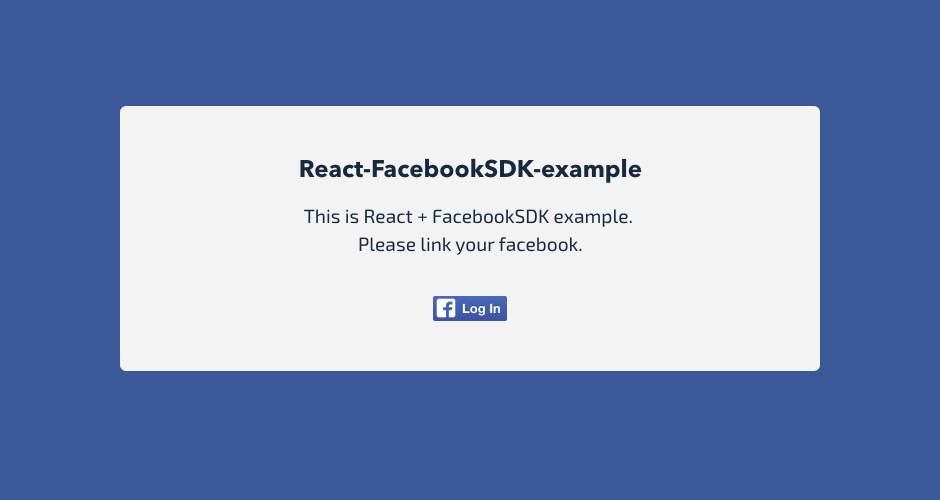

# React-FacebookSDK-example
This is React + FacebookSDK example.



#### Install Borbon, Neat, Bitters
```
$ gem install bourbon
$ gem install neat
$ gem install bitters
```

### Install
```
$ bower install
$ npm install
$ gulp install
```

### Setup
Set your application ID to main.coffee.
```
appId : 'your-app-id'
```

### Build & Run
```
$ gulp
```
